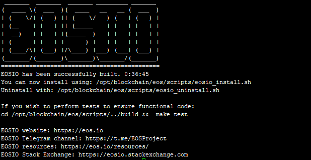
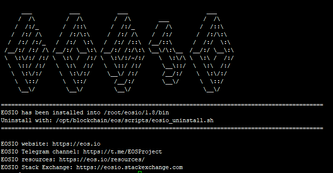
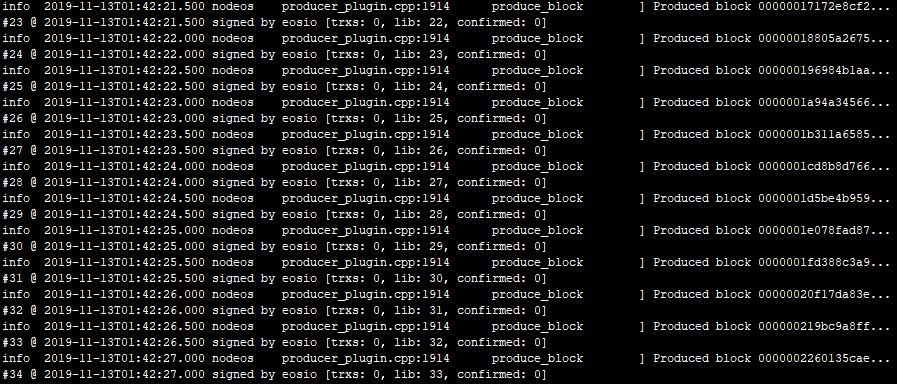
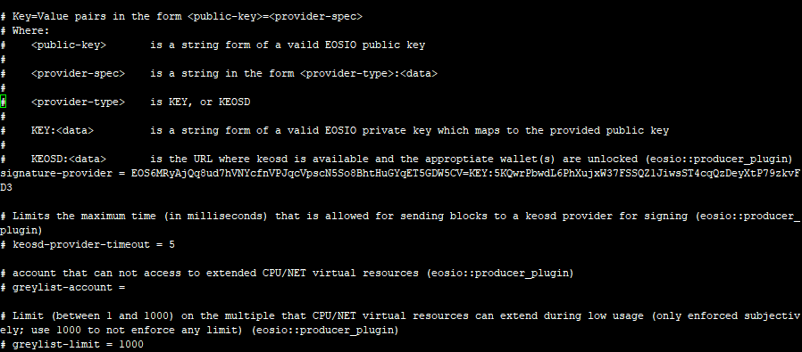

# 1.1 EOS开发环境搭建

> EOS DApp合约开发，可以选择以下三种网络进行开发：
>
> - 主网
> - Jungle 测试网络
> - 本地网络
>
> 在开发阶段一般选择测试网络和本地网络皆可，测试完成后在部署到主网。这里我们先选择在本地网络上进行开发，因为在Jungle 测试网络中不支持wallet的RPC接口，因为它作为一个公共的服务节点，是不可能帮助大家管理私钥的，那样会非常不安全，大家都会共用相同的钱包和私钥。最后我们将使用本地搭建的keosd服务管理钱包，并连接到Jungle 测试网络和EOS主网中。


**开发环境：CentOS 7.7 64位， 内存16G，eos v1.8.6，cdt v1.6.3， root用户**


EOS环境安装可以使用以下两种方式：

- docker配置：熟悉Docker的同学使用Docker配置就比较快捷了，可以快速安装并启动节点。
- 自动编译和安装的脚本：适用于大多数开发人员，脚本已经编写好，直接运行即可安装。

**方式一：docker安装eos节点环境**

- docker安装的教程大家直接查看[docker配置官方教程](https://developers.eos.io/eosio-home/v1.7.0/docs/getting-the-software)。
- 需要另外安装eosio.cdt编译工具。
- 装好环境后再去执行第五、六步骤，创建钱包、部署eosio.token合约。

**方式二：脚本安装eos节点环境**

- 参考下文即可。

  

## 一、下载和编译EOS

获取EOS指定版本源码及其所有子模块，若不加入--recursive参数，则不能下载EOS关联的子项目。

```
git clone https://github.com/EOSIO/eos --recursive
```

 如果忘记使用“–recursive”，可在克隆下的eos目录中执行 

```
git submodule update --init --recursive
```

获取EOS指定版本源码及其所有子模块，若不加入--recursive参数，则不能下载EOS关联的子项目。

```
cd eos
git checkout v1.8.6
```

编译源码生成可执行文件

```
cd eos/scripts
./eosio_build.sh
```

编译时间比较长，需一两个小时不等，若编译顺利成功后，则会看到如下显示




在编译的过程中很有可能会出现各种错误，由于系统、EOS版本的差异出现的错误也会不一样，下面列出了常见的多种错误的解决办法。


## 二、编译时报错解决办法

### 1. 物理内存RAM不足

**解决办法：**

修改文件源码`eos/scripts/eosio_build_ubuntu.sh`中的`if [ "${MEM_MEG}" -lt 7000 ]; then`，将7000改为自己系统的内存大小，如4000，如还报错，那么继续减小。

### 2. 可用内存不足

```
You must have at least 20GB of available storage to install EOSIO.
Exiting now.
```

**解决办法：**

在文件源码`eos/scripts/eosio_build_ubuntu.sh`中增加如下一行代码代码前面。

```
DISK_MIN=1
```

### 3. 不能创建/tmp/llvm-compiler文件夹

**解决办法：**

进入`/tmp`目录，删除`llvm-compiler`文件夹即可。


## 三、安装EOSIO

安装所有依赖库并构建EOSIO，使用如下命令

```
./eosio_install.sh
```

安装成功后的效果如下

  

安装完在根目录新增了build文件夹


## 四、下载和编译CDT

获取CDT指定版本源码及其所有子模块，若不加入--recursive参数，则不能下载CDT关联的子项目。

```
git clone --recursive https://github.com/eosio/eosio.cdt
```

 如果忘记使用“–recursive”，可在克隆下的eos目录中执行 

```
git submodule update --init --recursive
```

获取EOS指定版本源码及其所有子模块，若不加入--recursive参数，则不能下载EOS关联的子项目。

```
cd eosio.cdt
git checkout v1.6.3
```

编译源码生成可执行文件

```
./build.sh
```

编译时间比较长，需一两个小时不等，若编译顺利成功后，则会看到如下显示


## 五、安装EOS.CDT

安装所有依赖库并构建EOS CDT，使用如下命令

```
./install.sh
```

安装成功后的效果如下


## 六、编译CDT时报错解决办法

### 1. Unable to enable Centos devtoolset-7 at this time

**解决办法：**

centos7自带的gcc和gdb版本都太老了，学习的时候可能会需要使用c++的新特性，所以选择了scl这个软件集合。

安装步骤很简单：

```shell
yum install centos-release-scl
yum install devtoolset-7
scl enable devtoolset-7 bash
```

为了避免每次手动生效，可以在.bashrc中设置：

```shell
source /opt/rh/devtoolset-7/enable
or
source scl_source enable devtoolset-7
```


## 七、下载和编译系统相关合约

获取eosio.contracts源码。

```
git clone https://github.com/EOSIO/eosio.contracts.git
```

获取EOS指定版本源码

```
cd eosio.contracts
git checkout v1.8.1
```

编译源码生成可执行文件

```
./build.sh
```

编译时间比较长，需一两个小时不等，若编译顺利成功后，则会看到如下显示


## 八、编译eosio.contracts时报错解决办法

### 1. By not providing "Findeosio.cdt.cmake" in CMAKE_MODULE_PATH this project
  has asked CMake to find a package configuration file provided by
  "eosio.cdt", but CMake did not find one.

**解决办法：**

编译时没有找到cdt路径，在eosio.contracts根目录和contracts目录的CMakefile指定cdt路径：

```shell
set(eosio.cdt_DIR /usr/local/eosio.cdt/lib/cmake/eosio.cdt)
find_package(eosio.cdt)
```


## 九、配置Nodeos与Keosd

### 1. 配置Nodeos

`Nodeos`是用来运行节点的EOSIO程序。执行一下步骤进行配置：

- 找到如下config.ini文件的位置，第一次可能没有此文件，运行一下nodeos，会自动创建该文件
  
  ```
  ./nodeos -e -p eosio --plugin eosio::chain_api_plugin --plugin eosio::history_api_plugin
  ```
  
- 然后打开config.ini文件
  
  - Mac OS: `~/Library/Application\ Support/eosio/nodeos/config/config.ini`
  - Linux: `~/.local/share/eosio/nodeos/config/config.ini`
  
- 将文中`enable-stale-production`所在行用`#`注释，`producer-name`所在行也用`#`注释

- 再最后面添加如下内容

```
# Enable production on a stale chain, since a single-node test chain is pretty much always stale
enable-stale-production = true
# Enable block production with the testnet producers
producer-name = eosio
# Load the block producer plugin, so you can produce blocks
plugin = eosio::producer_plugin
# As well as API and HTTP plugins
plugin = eosio::chain_api_plugin
plugin = eosio::http_plugin
# This will be used by the validation step below, to view history
plugin = eosio::history_api_plugin
plugin = eosio::producer_api_plugin
```

以后启动nodeos，就不用每次输入一长串命令，只需输入以下命令，启动nodeos就可以了

```
nohup ./nodeos &
```


### 2. 配置Keosd

`keosd` 是一个轻客户端钱包，负责管理钱包，以便在广播到网络之前保护密钥和签署交易，在本地计算机上运行并在本地存储您的私钥。

- 找到路径`~/eosio-wallet/config.ini`，然后打开config.ini文件

- 将第一行的服务地址设置为：`http-server-address = 127.0.0.1:8889`

  

## 十、启动节点

### 1. 启动nodeos

使用以下命令启动自己的单节点区块链：

```
nohup ./nodeos &
```

启动后应该每0.5秒生成一个块并有日志输出到终端，如下



如果报错，则添加参数`--delete-all-blocks`


### 2. 启动keosd

可以直接输入命令`keosd`即可启动keosd。

```
$ keosd
```

停止keosd，因为`cleos`可以自动启动`keosd`，最终可能会有多个`keosd`正在运行。

```
$ pkill keosd
```

**注意：**当使用RPC接口时，需要另起keosd，且端口与nodeos的不能一样。在使用cleos连接wallet时不用另外单独启动keosd，它连接的是nodeos的keosd服务。若使用cleos时报如下错误，则须停止keosd。

```
cleos wallet create
"/usr/local/eosio/bin/keosd" launched
Unable to connect to keosd, if keosd is running please kill the process and try again.
```


## 十一、使用Cleos创建钱包

下面我们使用命令行进行操作，需要使用到Cleos，它是一个命令行工具，可以与nodeos公开的REST API进行交互，前提是nodeos需要配置`eosio :: chain_api_plugin`插件。

### 1. 创建钱包

钱包是授权私钥的存储库，与区块链交互所必需的。通过如下命令创建钱包，可以通过`-n`参数指定创建的钱包名称。如果不指定钱包名称，则会创建一个名为`default`的默认钱包。

```
cleos wallet create
```

若是1.2以上版本，则需添加参数`--to-console`，输出如下

```
cleos wallet create --to-console
"/root/eosio/1.8/bin/keosd" launched
Creating wallet: default
Save password to use in the future to unlock this wallet.
Without password imported keys will not be retrievable.
"PW5KMSXJd233a1bvoXyTGjPiZAhLQMF7FRX5XwwnrdYBaP6eVXM9w"
```

成功后将会生成钱包的解锁密码，钱包15分钟不用将会自动锁定，注意一定要保存最后一行的密码，需要使用它解锁这个钱包。

### 2. 解锁钱包

可以通过两种方式解锁钱包，推荐使用第二种方式解锁。

- 直接在命令行上添加密码参数，可以通过`-n`参数指定钱包名称

```
cleos wallet unlock --password PW5KMSXJd233a1bvoXyTGjPiZAhLQMF7FRX5XwwnrdYBaP6eVXM9w
```

- 在交互模式下解锁

```
cleos wallet unlock
```

接着提示`password:`，然后输入密码即可

```
cleos wallet unlock
password:
```

两种方式解锁成功后都会输出`Unlocked: default`。

**注意：**

> 直接在命令行上使用您的密码并将其记录到您的bash历史记录中通常是不安全的，因此最好在交互模式下解锁。出于安全考虑，最好在不使用钱包时使用命令`cleos wallet lock`将钱包锁定。
>

### 3. 查看钱包列表

使用命令`cleos wallet lock`查看钱包列表，在列表中解锁后的钱包将在钱包名后面有`*`标记。

```
cleos wallet list
Wallets:
[
  "default *",
]
```

### 4. 导入密钥到钱包

上述步骤中启动的私有区块链是使用默认初始密钥创建的，必须将其加载到钱包中。

使用命令`cleos wallet import --private-key ******`。可以通过`-n`参数指定钱包名称

```
cleos wallet import --private-key 5KQwrPbwdL6PhXujxW37FSSQZ1JiwsST4cqQzDeyXtP79zkvFD3
imported private key for: EOS6MRyAjQq8ud7hVNYcfnVPJqcVpscN5So8BhtHuGYqET5GDW5CV
```

注意：此时导入的私钥并不是创建钱包时生成的密码。

这个密钥`5KQwrPbwdL6PhXujxW37FSSQZ1JiwsST4cqQzDeyXtP79zkvFD3`在以下配置文件中可以查看

- Mac OS: `~/Library/Application\ Support/eosio/nodeos/config/config.ini`
- Linux: `~/.local/share/eosio/nodeos/config/config.ini`

打开文件后滑动到最下面即可查看到私钥。



注意该秘钥对正是超级账户 eosio的秘钥对。接下来就会用到eosio账户。


## 十二、部署系统相关合约

现在我们有一个拥有帐户eosio密钥的钱包`defualt`，确保钱包`defualt`处于解锁状态。eosio账户是默认就有的，在系统启动的时候就自动被创建的超级用户。

### 1. 创建相关账号

那么接下来用eosio账户创建eosio.token系统账号。

```
cleos create account eosio eosio.bios EOS6MRyAjQq8ud7hVNYcfnVPJqcVpscN5So8BhtHuGYqET5GDW5CV
cleos create account eosio eosio.token EOS6MRyAjQq8ud7hVNYcfnVPJqcVpscN5So8BhtHuGYqET5GDW5CV
cleos create account eosio eosio.system EOS6MRyAjQq8ud7hVNYcfnVPJqcVpscN5So8BhtHuGYqET5GDW5CV
cleos create account eosio eosio.rex EOS6MRyAjQq8ud7hVNYcfnVPJqcVpscN5So8BhtHuGYqET5GDW5CV
cleos create account eosio eosio.ram EOS6MRyAjQq8ud7hVNYcfnVPJqcVpscN5So8BhtHuGYqET5GDW5CV
cleos create account eosio eosio.bpay EOS6MRyAjQq8ud7hVNYcfnVPJqcVpscN5So8BhtHuGYqET5GDW5CV 
cleos create account eosio eosio.msig EOS6MRyAjQq8ud7hVNYcfnVPJqcVpscN5So8BhtHuGYqET5GDW5CV 
cleos create account eosio eosio.names EOS6MRyAjQq8ud7hVNYcfnVPJqcVpscN5So8BhtHuGYqET5GDW5CV 
cleos create account eosio eosio.ramfee EOS6MRyAjQq8ud7hVNYcfnVPJqcVpscN5So8BhtHuGYqET5GDW5CV 
cleos create account eosio eosio.saving EOS6MRyAjQq8ud7hVNYcfnVPJqcVpscN5So8BhtHuGYqET5GDW5CV 
cleos create account eosio eosio.stake EOS6MRyAjQq8ud7hVNYcfnVPJqcVpscN5So8BhtHuGYqET5GDW5CV 
cleos create account eosio eosio.upay EOS6MRyAjQq8ud7hVNYcfnVPJqcVpscN5So8BhtHuGYqET5GDW5CV

```

### 2. 部署eosio.bios合约

使用eosio.token账号部署eosio.token合约。

```
cleos set contract eosio build/contracts/eosio.bios -p eosio@active
```

### 3 部署eosio.bios时报错env.is_feature_activated unresolveable解决办法：

```
curl -X POST http://127.0.0.1:8888/v1/producer/get_supported_protocol_features -d '{}' | jq
返回数组中，找到指向PREACTIVATE_FEATURE代码名的对象, 例如:
{
  "feature_digest": "0ec7e080177b2c02b278d5088611686b49d739925a92d9bfcacd7fc6b74053bd",
  "subjective_restrictions": {
    "enabled": true,
    "preactivation_required": false,
    "earliest_allowed_activation_time": "1970-01-01T00:00:00.000"
  },
  "description_digest": "64fe7df32e9b86be2b296b3f81dfd527f84e82b98e363bc97e40bc7a83733310",
  "dependencies": [],
  "protocol_feature_type": "builtin",
  "specification": [
    {
      "name": "builtin_feature_codename",
      "value": "PREACTIVATE_FEATURE"
    }
  ]
},
上面例子中，PREACTIVATE_FEATURE 协议特性的digest数值为: 0ec7e080177b2c02b278d5088611686b49d739925a92d9bfcacd7fc6b74053bd. 请注意，由于对特定区块链网络的协议特性配置所做的本地更改的原因，该数值可能会有所变化。

获取了该数值之后，可以用如下的命令发送至本地出块的 nodeos 程序实体，在下一次该节点出块时激活 PREACTIVATE_FEATURE 协议:
curl -X POST http://127.0.0.1:8888/v1/producer/schedule_protocol_feature_activations -d '{"protocol_features_to_activate": ["0ec7e080177b2c02b278d5088611686b49d739925a92d9bfcacd7fc6b74053bd"]}' | jq
只能够在设定的激活时间之后，才使用上述命令。 PREACTIVATE_FEATURE 协议特征的激活时间，是经过 BP 一致同意后，在配置文件中对earliest_allowed_activation_time这一字段进行的设定。
任何 v1.8.x 的同步节点可用以下命令检查已激活了哪些协议特征:
curl -X POST http://127.0.0.1:8888/v1/chain/get_activated_protocol_features -d '{}' | jq
例如，若 PREACTIVATE_FEATURE 协议特征已激活，可能会得到如下的返回数组(注意，某些数值，特别是activation_block_num 该字段，可能会有所变化):

{
  "activated_protocol_features": [
    {
      "feature_digest": "0ec7e080177b2c02b278d5088611686b49d739925a92d9bfcacd7fc6b74053bd",
      "activation_ordinal": 0,
      "activation_block_num": 348,
      "description_digest": "64fe7df32e9b86be2b296b3f81dfd527f84e82b98e363bc97e40bc7a83733310",
      "dependencies": [],
      "protocol_feature_type": "builtin",
      "specification": [
        {
          "name": "builtin_feature_codename",
          "value": "PREACTIVATE_FEATURE"
        }
      ]
    }
  ]
}
PREACTIVATE_FEATURE 协议特征激活之后，可以部署添加了 activate 激活指令的新的系统合约了。
（注：在新的系统合约中，添加了一项操作：activate, 可用于激活后续的协议特征。）

```

### 

### 4. 部署eosio.token合约

使用eosio.token账号部署eosio.token合约。

```
cleos set contract eosio.token build/contracts/eosio.token
```

### 5. 创建EOS代币

发行人可以对该Token合约执行一些特有的操作，例如质押、赎回、账号冻结、资金冻结、游戏挖矿、空投、召回和列入所有者白名单等功能。使用如下命令创建Token代币

```
cleos push action eosio.token create '[ "eosio", "1000000000.0000 EOS"]' -p eosio.token@active
```

此命令是通过`eosio.token`账户创建了一个Token，发布者是`eosio`，Token名为`EOS`，其精度为4位小数，发布的总量是1000000000.0000 EOS。

### 6. 查询代币信息

根据命令`cleos get currency stats`可以查看查询代币命令的参数

```
$ cleos get currency stats

ERROR: RequiredError: contract
Retrieve the stats of for a given currency
Usage: cleos get currency stats contract [symbol]

Positionals:
  contract TEXT               代币合约名称 ，此项必填
  symbol TEXT                 代币符号，例如 EOS ，此项必填
```

因此，可知查询账户余额的命令为 `cleos get currency stats 合约名称 代币符号`

```
cleos get currency stats eosio.token EOS
{
  "EOS": {
    "supply": "0 EOS",
    "max_supply": "1000000000.0000 EOS",
    "issuer": "eosio"
  }
}
```

大家可根据此方式去输入cleos命令，后面将不再详细介绍。

发行代币的步骤将在后续创建了玩家账号后再发行EOS。


### 7. 给eosio账号发行EOS

根据命令`cleos get currency stats`可以查看查询代币命令的参数

```
cleos push action eosio.token issue '[ "eosio", "100000000.0000 EOS", "首发" ]' -p eosio@active
```

### 8. 部署system合约  

```
cleos set contract eosio build/contracts/eosio
```
### 9. 调用system合约报错: system contract must first be initialized
```
cleos push action eosio init '[0,"4,EOS"]' -p eosio@active
```

### 10. 创建账号报错报错: account has insufficient ram; needs 2996 bytes has 0 bytes
```
cleos create key --to-console
Private key: 5HuYnCjaUZNgzb7Twmtve2SfBaJyNMq4tkBPmT5bEF6nTuL7xyN
Public key: EOS5vqsXKMGjUR26f24zUPSi5DNNaPFBwLTicyWqJ492eAL1jp6ys

cleos system newaccount --stake-net "10000.0000 EOS" --stake-cpu "10000.0000 EOS" --buy-ram-kbytes 1024 eosio poker EOS5vqsXKMGjUR26f24zUPSi5DNNaPFBwLTicyWqJ492eAL1jp6ys
```
